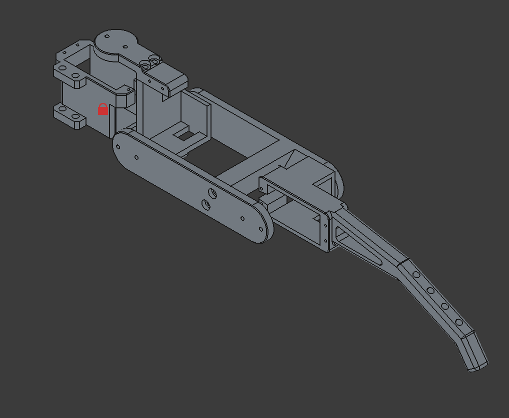

# Spider Quadruped Robot

I built this cute spider robot from scratch with esp32 and lots of determination. by trials and errors, this robot improve bit by bit...

this is still experimental project, not a finished one yet!

## Components
12 x mg996R servo
1 x esp32 wroom
1 x 7.4V 2200mAh lipo battery
2 x PCA9685 driver
1 x 3.3v buck converter
1 x 20A buck converter
2 x 2200uF 10V capacitor
1 x MPU6050
M2/M3 screws and heat insertion set
3D printed parts (can be download in 3D models folder)

## how to run
### 1) Servo calibration
I don't have the calibration file uploaded here but you can do it by setting Coxa and Femur joint to 90 degree and Tibia to 0 degree.
### 2) Assemble 
copy this image. the leg should be stretch out like this

### 3) Movement TEST (No MPU6050 needed)
you can run the IK_test.ino file first for one leg.
the leg will follow a cycloidal curve to perform a step.
after that you can move-on to 1legs_test.ino (you have to fully assemble the robot)

